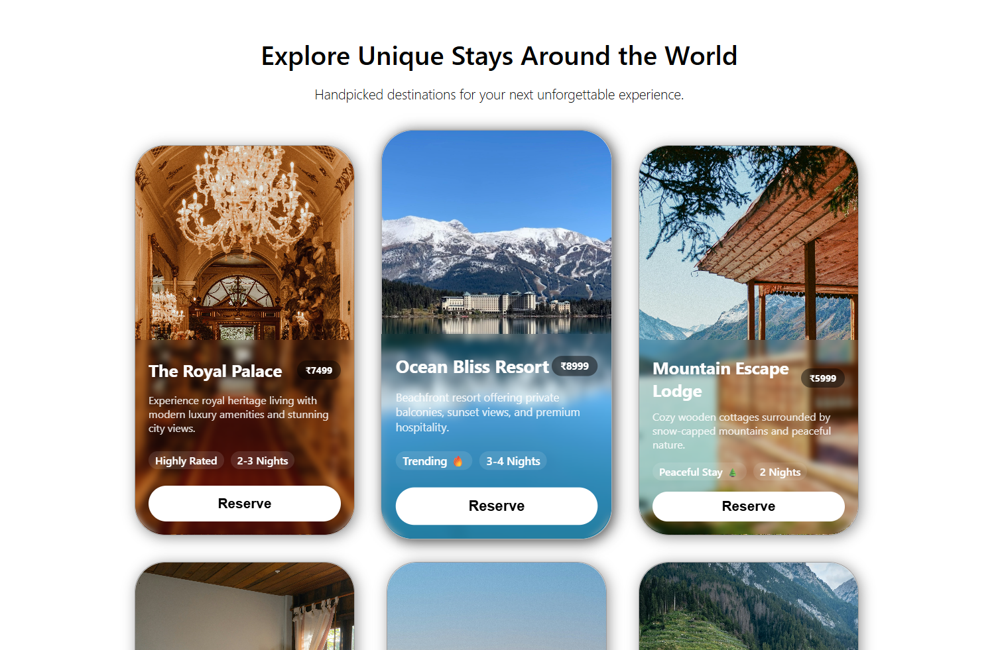

# React Cards Practice Project

This is a small React project built to practice creating reusable components and implementing modern CSS effects like hover animations and backdrop blur.  
The project is **not production-level**, but it's a fun playground to explore React, CSS Grid, and interactive UI elements.

---

## Features

- **Reusable Card Component**: Each card displays an image, title, description, price, and additional info.
- **Hover Effects**: Smooth lift and scale animation on hover.
- **Backdrop Blur on Info**: Card information has a blur effect for a modern UI feel.
- **Responsive Layout**: Cards are arranged using CSS Grid for a clean layout.
- **Custom Styling**: Rounded corners, shadows, and subtle animations.

---

## Demo

Here’s a preview of a card with hover effect:



---

## Getting Started

### Prerequisites

- Node.js installed
- Basic knowledge of React

### Installation

1. Clone this repository:

```bash
git clone https://github.com/yourusername/react-cards-practice.git
```

2. Navigate into the project folder:

```bash
cd react-cards-practice
```

3. Install dependencies:

```bash
npm install
```

4. Install dependencies:

```bash
npm install
```

## Folder Structure

```bash
├── src/ (2000 tokens)
├── App.css
├── Content/ (300 tokens)
│ ├── contentBox.module.css
│ └── contentBox.jsx (200 tokens)
├── main.jsx
├── App.jsx
├── header/ (200 tokens)
│ ├── header.module.css
│ └── header.jsx
├── index.css
├── Components/ (600 tokens)
│ ├── card.jsx (200 tokens)
│ └── card.module.css (400 tokens)
└── Data/ (600 tokens)
│ └── data.jsx (600 tokens)
├── vite.config.js
├── README.md
├── .gitignore
├── index.html
├── package.json (200 tokens)
└── eslint.config.js (200 tokens)
```

## Technologies Used

- **React** - for building reusable components
- **CSS Grid** - for layout
- **CSS Transitions & Transform** - for hover animations
- **Backdrop Filter** - for blur effects on card info

## Notes

- This project was mainly for **practice**, so features are minimal.
- Hover animations and blur effects were added to **explore interactive UI techniques**.
- Cards are easily **extendable** to any dataset.
